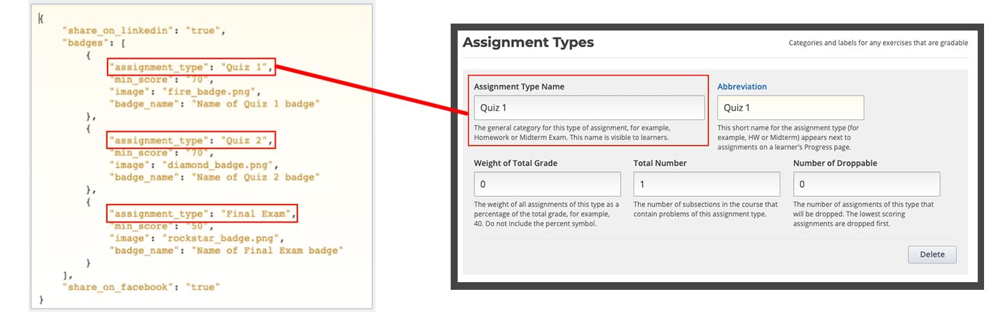
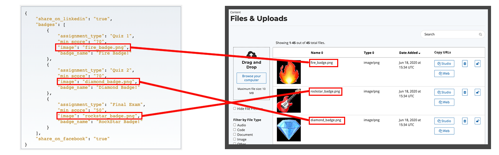

# Configuration of Badges


The configuration of badges is an advanced feature, do not hesitate to contact us if you need assistance. Ready to enter the matrix? 😂



## Step 1: Configure Badges in Advanced Settings&#x20;

To activate badges in your course, you must configure a set of elements in the advanced course settings.

1. From **Studio** Home, select the desired course to enter the **Course Outline**
2. Select **Settings > Advanced Settings**
3. Find the property '_**Other Course Settings'**_&#x20;
4. Copy / paste the code below into the text box. &#x20;
5. Save the modifications

```java
{
    "share_on_linkedin": "true",
    "badges": [
        {
            "assignment_type": "Quiz 1",
            "min_score": "70",
            "image": "fire_badge.png",
            "badge_name": "Name of Quiz 1 badge"
        },
        {
            "assignment_type": "Quiz 2",
            "min_score": "70",
            "image": "diamond_badge.png",
            "badge_name": "Name of Quiz 2 badge"
        },
        {
            "assignment_type": "Final Exam",
            "min_score": "50",
            "image": "rockstar_badge.png",
            "badge_name": "Name of Final Exam badge"
        }
    ],
    "share_on_facebook": "true"
}
```

.png>)

## Step 2: Configure Badges in the Course Grading Menu

Below are the instructions for your badge configuration.&#x20;

* From _**Course Outline**_ select _**Settings > Grading**_&#x20;
* Select _**New Assignment Type**_


* Add the name of the `assignment_type`  (previously configured in _**Settings > Advanced Settings > Other Course Settings**_ ) for which the badge will refer.&#x20;


In the code you copy & pasted from Step 1, we used "Quiz 1", "Quiz 2", and "Final Exam".&#x20;





_If you want to change name of the assignment type, you will need to go back to **Settings > Advanced Setting > Other Course Settings** and modify it in the code._&#x20;


* `min_score`: Refers to the minimum score required of the learner to obtain the badge. If you have several assignments of the same type, this is the average for the type of assignment configured in`assignment_type`. _For example, you could configure multiple assignments / quizzes to be graded as 'Quiz 1', and the learner would achieve the badge after having completed all those assignments / quizzes and achieving an average of at least the 'minimum score'._&#x20;
* `image`: This is the name for the image of the badge. You can upload your badge images in _**Content > Files & Uploads**_. Avoid special characters and spaces in image file names. Make sure the name of your images match the image names in your 'badge code'. &#x20;



* `badge_name`: This is the name of the badge as it will be visible to learners of your course.&#x20;
* `share_on_facebook` : `true` or `false` to activate sharing of the badge on Facebook
* `share_on_linkedin` : `true` or `false` to activate sharing of the badge on LinkedIn

To add a badge, simply copy and paste all the elements between the braces `{ assignment_type... },` and separating each group with a comma.
