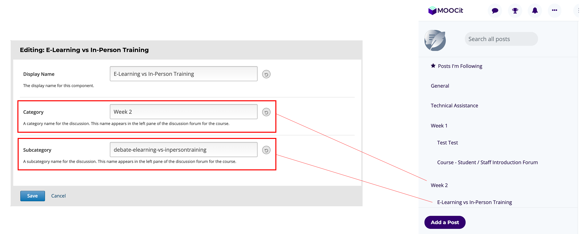

# Discussion Forums

## How to Participate in Discussions&#x20;

The Discussion page is accessible for learners in the LMS via the 'chat bubble icon' in the header menu.&#x20;

Here, learners can browse discussion topics, and find instructions on how to use the discussion forums.&#x20;

To create a new post inside a discussion, select 'Add a Post'. \
Select their post type, topic (discussion) area, title and type their question or idea.&#x20;

## Course Wide Discussions vs Content-Specific Discussions

There are 2 types of discussions you can create: course-wide discussions and content-specific discussions.&#x20;

**Course-Wide Discussions**\
Course-wide discussions are added in the advanced settings, and are only available in the ‘Discussion’ page of the LMS. By default, all courses include a page named Discussion with a course-wide discussion topic named “General”.&#x20;

Course-wide discussion topics are useful for offering administrative assistance, technical help, or other topics that are useful for learners throughout the duration of the course.

**Content-Specific Discussions**\
Content-specific discussions are created on the unit page using the discussion component. These discussions are available for learners on the Course Unit page where it is published, _and_ on the discussions page. Content-specific discussions are useful for discussing course topics at the moment learners are covering it.&#x20;

## **How to Create Course-Wide Discussion Topics**

1\) Open up your Course in Studio \
2\) From your Course Outline, select Settings > Advanced Settings. \
3\) Scroll down to the Discussion Topic Mapping&#x20;

By default it will look like this:&#x20;

4\) Copy 3 lines for the General Topic and paste them above the closing brace character. \
5\) Add a comma after the first closing brace.\
6\) Replace the second “General” with the name of your new Discussion topic. Then, give the discussion a unique ID&#x20;

7\) Select to save\
8\) Scroll back to Discussion topic Mapping to make sure your changes were saved correctly.&#x20;


Entries that do not contain all of the required punctuation characters revert to the previous value when you save.


## **How to Create Content-Specific Discussion Topics**

1\) Open your course in Studio \
2\) From the course outline open the Unit in which you wish to add your discussion. \
3\) Select to add the Discussion Component then select to edit.&#x20;

\
4\) Select to 'edit' your discussion component. \
5\) Change the display name (visible on the Unit Page) \
6\) Modify the text for 'Category' and 'Subcategory' (visible on the Discussions Page)&#x20;

7\) Select to Save, Publish and View Live \
8\) View your Discussion on the Discussions page in Learner View.
