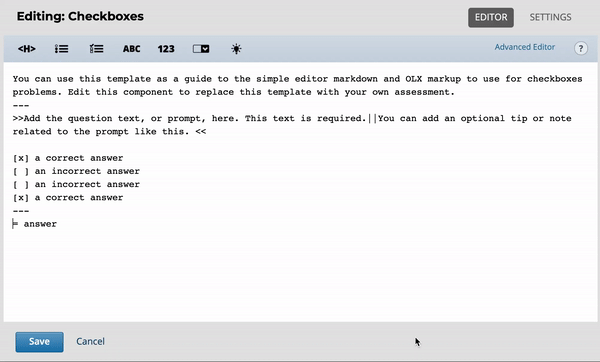

# Add Multiple Questions

## Overview

When adding problem components to your Units, you may add each question as an individual problem component, _**or**_ add multiple questions to a single problem component. This may be a useful feature when you have multiple questions related to the same, general 'problem'.&#x20;

From Learner View, a problem component with multiple questions would look like this:&#x20;

As you can see, there is only one component title, and multiple questions (in blue shaded boxes). All three of these question are within a single problem component.&#x20;

## How to add Multiple Questions&#x20;

#### 1) Select to edit your problem component.&#x20;

#### 2) Add 3 hyphens (`---`) before and after your question.&#x20;

#### 3) Select to add (an) additional question(s)&#x20;

#### 4) Copy & paste _question prompt text_ into the new question & modify.&#x20;

#### 5) Add 3 hyphens (`---`) after each new question.&#x20;

#### 6) Save&#x20;

That's all there is to it! \
\
Now you can _**Publish**_ and _**View Live**_, or select '_**Preview'**_ to see how your questions look in **Learner View**.&#x20;
