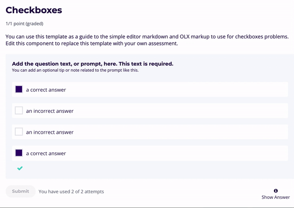

# Add an explanation (Show Answer)

_**Show Answer**_ is an optional feature. In the LMS, learners can select _**Show Answer**_ to view an explanation for a given question. _**Show Answer**_ can be configured so that it only accessible to learners after certain conditions have been met, such as: attempted question, answered question, etc.&#x20;

This is how _**Show Answer**_ appears in _Learner View_:

## Configuration of 'Show Answer'&#x20;

1\) Select to _**Edit**_ your problem component

.png>)

2\) Select the 💡 'lightbulb icon' to add an '**Explanation**' below your question. Then, modify the text \
' `short explanation` '.&#x20;

3\) Open the _**Settings**_ menu and locate _**Show Answer**_ to define when the answer will become accessible to your learners.&#x20;

#### Show answer available values

* **Always**: _Show Answer_ is always visible and accessible&#x20;
* **Answered**:  _Show Answer_ button is accessible only if after the question is answered 100% correctly
* **Attempted**: _Show Answer_ button is accessible once the learner has submitted at least one attempted answer
* **Closed**:  _Show Answer_ button is accessible only after all of the answer attempts have been used
* **Finished**: _Show Answer_ button is accessible when all attempts have been used **or** if the question is answered 100% correctly **or** the _Due date_ has passed (at subsection level)
* **Correct or Past Due**: _Show Answer_ button is accessible only if the question is answered 100% correctly **or** _Due date_ has passed (at subsection level)
* **Past Due**: _Show Answer_ button is accessible only after the _Due date_ has passed (at subsection level)
* **Never**: _Show Answer_ button is never accessible


Note: You need to _**View course as > Learner**_ to test these different behaviours.&#x20;

