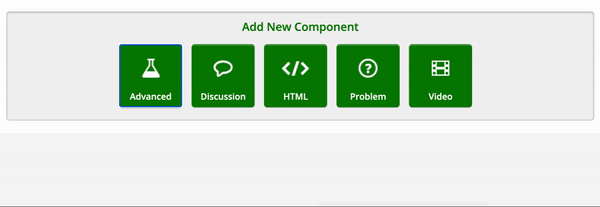

# Word Cloud


This component is ideal at the start of the module to collect the learners' ideas / keywords on a subject.


### Activate the component "Word Cloud"

1. Access Studio and select the desired course
2. Select _**Settings > Advanced Settings**_
3. Find the property "_**Advanced Module List**_" and add `"word_cloud"`&#x20;
4. Save changes

### Add a Word Cloud

1. Once activated, open the unit in which you wish to add the word cloud
2. Add the component _**Advanced > Word Cloud**_

