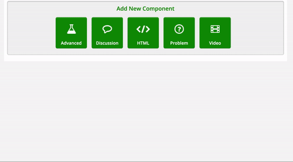
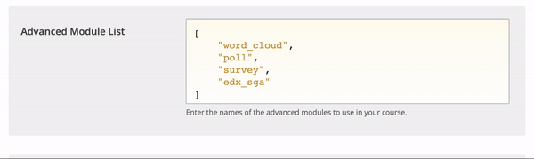
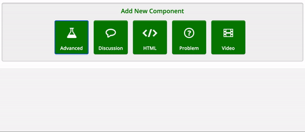

# PDF File

There are two methods for adding a PDF; directly in HTML5 OR via the advanced "pdf" component.


The advanced PDF component is not supported on mobile applications. If you plan to use PDF and mobile apps, we recommend using the HTML5 method.


### Add a PDF (HTML5)

1. Access Studio and select the desired course&#x20;
2. Select _**Content > Files & Uploads**_
3. Use the drag & drop box or _**'Browse your computer'**_ to upload your file.
4. Copy and paste the Studio URL


Make sure your file name does not contain special or accented characters.


1. Once the file has been added, go to the unit in which you want to add the PDF&#x20;
2. Under _**'Add New Component'**_, select  _**HTML > Raw HTML**_&#x20;
3. Copy and paste the code below and replace the Studio URL ("/static/mon\_fichier\_pdf.pdf") with that of your file

`<embed src="/static/mon_fichier_pdf.pdf" width="100%" height="1200px" type='application/pdf'>`

### Add a PDF (component)&#x20;

1. Access Studio and select the desired course&#x20;
2. Select _**Settings > Advanced Settings**_
3. Find the property _**Advanced Module List**_ and add `"pdf"`
4. Save changes

Now the PDF component will be available from the '_**Advanced**_ ' button.&#x20;

