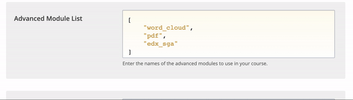
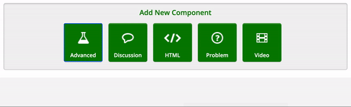

# Surveys & Polls

## Activate the Survey and Poll Components

1. Access Studio and select the desired course
2. Select _**Settings > Advanced Settings**_&#x20;
3. Find the property _**Advanced Module List**_ and add `"poll" ,"survey"`
4. Save changes

### Add a Poll

1. Select the unit in which you wish to add the survey
2. Select _**Advanced > Poll**_

Configure the poll according to your needs (questions, answers, etc..). To display several questions in the same survey, use the poll component.&#x20;

### Add a Survey

1. Select the unit in which you wish to add the survey
2. Select _**Advanced > Survey**_

Configure the survey according to your needs.

