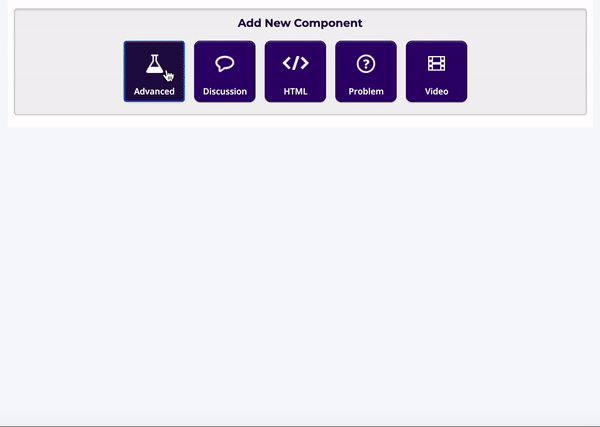

# SCORM

Open the Unit in Studio where you want to add your SCORM content.&#x20;

In **Settings** - **Advanced Settings**, make sure that "scormxblock" is added to your Advanced Module List&#x20;

Go to the Unit in Studio where you want to add your SCORM content.&#x20;

Under '**Add New Component**' Select '**Advanced**' '**SCORM**'&#x20;

Select to '**Edit**' the SCORM Component.&#x20;

Indicate the display name for your component,&#x20;

Upload the SCORM file (which should be in the form of a .zip file)

Indicate 'true' or 'false' whether the component will be graded or not.&#x20;

Finally, you can customize the Display Width / Hight if required.&#x20;

When you are done, select to '**Save**'.&#x20;

&#x20;In the Scorm component block you will see 'Look in LMS' - this is normal. 🙂

Select to '**Publish**' and '**View Live Version**' to see your SCORM component in Learner View.&#x20;

