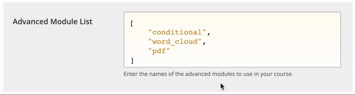

# ZOOM Meeting (Dedicated Instance)


You must first have a Zoom account and activate the LTI Pro application. Once the LTI Pro application has been added to your Zoom account, note the`Client`and`Secret` identifiers.


## Activate the ZOOM Component

1. Access Studio and select your course
2. Select Settings > Advanced Settings
3. Find the property 'Advanced Module List'
4. Add "edx\_zoom"
5. Save&#x20;

## Configure Zoom IDs


This step requires administrator rights. Contact your administrator if necessary.


1.  Access the administrator interface of the platform :&#x20;

    `https://<votre_url>/admin/edx_zoom/lticredentials`

