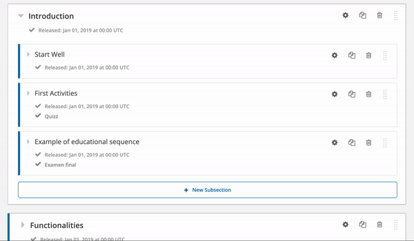
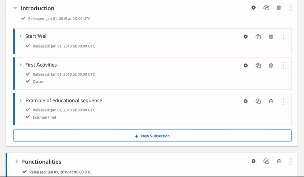

# Subsection Prerequisites


The prerequisites are an advanced functionality. We recommend that users have some Studio experience before using it. 😀


### Enable Subsection Prerequisites&#x20;

1. Connect to Studio and select the desired course
2. Select _**Settings > Advanced Settings**_&#x20;
3. Find the property _**Enable Subsection Prerequisites**_ and indicate `true`
4. Save changes

### Mark a subsection as a prerequisite&#x20;

1. Once the subsection prerequisites are enabled, go to the Course Plan.&#x20;
2. Locate the sub-section which you would like to use as a prerequisite for another subsection.
3. Select the ⚙️ (C_onfigure icon_), then the '_**Advanced'**_  tab_**.**_
4. Check the box _**Make this subsection available as a prerequisite to other content.\`**_

### Indicate a prerequisite for a subsection

1. Locate the subsection which you want to require a prerequisite for
2. Select the ⚙️ (C_onfigure icon_), then the '_**Advanced'**_  tab_**.**_
3. Select the prerequisite and indicate the minimum score / minimum completion the learner needs to achieve before they will be able to access the subsection.


_The above example indicates that in order for the learner to access the subsection  'First Activities', they must first complete 100% of the subsection 'Start Well' and achieve a score of 100%._&#x20;

