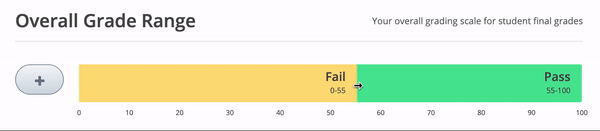
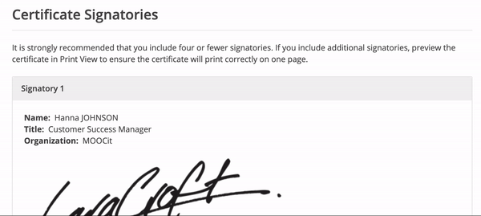

# Certificate Configuration

## Step 1: Configure Course Certificate Grading &#x20;

1. Connect to Studio and select the desired course.&#x20;
2. From the header menu select _**Settings > Grading**_&#x20;
3. In the section _**'Overall Grade Range'**_, select the required grade to obtain the certificate.&#x20;

## Step 2: Setting / Modifying the Course Title&#x20;

1. From the header menu select _**Settings > Certificate**_
2. Under _**'Certificate Details'**_ you will see your course title as it will appear on the certificate.&#x20;
3. If desired, override the current course title by selecting '🖊️_**Edit**_ ' and filling out the '_**Course Title Override**_' text box. _This will only modify the name of the course on the course certificate_&#x20;

## Step 3: Adding / Modifying Certificate Signatories&#x20;

1. From the header menu select _**Settings > Certificate**_
2. Under '_**Certificate Signatories**_' select '🖊️_**Edit**_ ', then add/modify the Name, Title, and Organization of the signatory as you want it to appear on the course certificate
3. _**'Upload Signature Image'**_ in PNG format
4. Select '_**Save**_'

_To add an additional signatory select **'Add Additional Signatory'**._&#x20;

## Step 4: Modify the Course Offering Organisation Name on the Course Certificate

To change the organization name for 'a course of study offered by ....', follow these steps:&#x20;

1. From the header menu select _**Settings > Advanced Settings**_
2. Locate _**Course Organization Display String**_&#x20;
3. Input the desired organization name with quotation marks. &#x20;
4. Save changes

.gif>)

## Step 5: Preview Certificate

1. Select _**Settings > Certificate**_&#x20;
2. Select _**'Preview Certificate'**_ to see the final certificate

## Step 6: Activate Certificate

1. Select _**Settings > Certificate**_
2. Select '_**Activate**_' to activate&#x20;

## Step 7: Enable Student-Generated Certificates

By enabling student-generated certificates, students will be able to request and view the certificate earned in the course.&#x20;

1. Select _**Content > Outline**_
2. Select _**'View Live'**_
3. Select '_**Instructor**_ ' to enter the _**Instructor Dashboard**_
4. Select '_**Certificates'**_
5. Select _**'Enable Student Generated Certificates'**_&#x20;

## Step 8: Modify Certificate Behavior&#x20;


:bulb: After certificate generation, students who passed see a link to their certificates on the dashboard and students who did not pass see information about the grading configuration. The default is to only display certificates to students after the end of the course date.


To display certificate information to all students as soon as certificates are generated:

1. Enter **Studio**
2. Select _**Settings > Advanced Settings**_
3. Locate _**'Certificates Display Behavior'**_
4. Enter **"early\_with\_info"** inside quotations in the text box.&#x20;

To only display certificate links to passing students as soon as certificates are generated:&#x20;

1. Enter **Studio**
2. Select _**Settings > Advanced Settings**_
3. Locate _**'Certificates Display Behavior'**_
4. Enter **"early\_no\_info"** inside quotations in the text box.&#x20;

## Step 9: Change 'View Certificate' Button in Student View

From the student dashboard, students can see 'View Certificate' button for their course. If you want to change this, you can. For example, we could change it to 'View Diploma'.&#x20;

1. Enter Studio
2. Select _**Settings > Advanced Settings**_
3. Locate _**'Certificate Name Short'**_
4. Enter the desired name inside the quotations in the text box.&#x20;
5. Save changes

## &#x20;&#x20;
