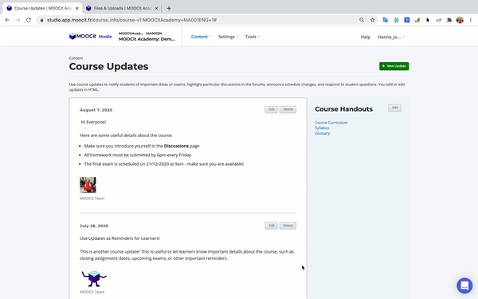

# Course Handouts

## Course Handouts in Learner View (LMS)&#x20;


Course Handouts are available for learners to download on the Course Outline page. Course Handouts appears in a panel below the course description. Also in the Course Handouts panel, you can add social medial links in case you want learners to join your social pages. You can add as many downloadable handouts here as you want.&#x20;

## How to add a Course Handout

Course handouts are accessible from **Studio**  >  **Content** > **Updates**


In the right panel select to **Edit** the course handout section and an html editor will appear. In the editor, type your update using HTML formatting. If you aren't familiar with HTML, you can copy & paste one of the following templates:&#x20;

### Course Handout Panel HTML Templates

#### Bulleted List of Course Handouts


```
<p>
<li><a href="/static/examplefile.pdf" target="_blank">Course Curriculum</a></li>
 <li><a href="/static/examplefile.pdf" target="_blank">Syllabus</a></li>
 <li><a href="/static/examplefile.pdf" target="_blank">Glossary</a> </li></p> 
```

#### List of Course Handouts


```
<p>
  <a href="/static/examplefile.pdf" target="_blank">Course Curriculum</a> <br>
 <a href="/static/examplefile.pdf" target="_blank">Syllabus</a><br>
 <a href="/static/examplefile.pdf" target="_blank">Glossary</a> </p> 
```

#### Replace Download Files + Text:&#x20;

1. Open **Content** > **Files & Uploads** in a separate tab or window&#x20;
2. Select to copy the **Studio** URL for the file you want to add
3. Return to **Content** > **Updates** page&#x20;
4. Replace the code `/static/examplefile.pdf` with the URL you just copied
5. Replace the text that appears just between the final `"` of the URL and the closing `</a>`
6. Select to **Save**



#### Regular List with Social Media Links


```
<p>
  <a href="/static/examplefile.pdf" target="_blank">Course Curriculum</a> <br>
 <a href="/static/examplefile.pdf" target="_blank">Syllabus</a><br>
 <a href="/static/examplefile.pdf" target="_blank">Glossary</a> </p> 
<br>
<a class="social-icon" target="_blank" href="https://www.facebook.com/academiedugout"><i class="fa fa-facebook"></i></a>
<a class="social-icon" target="_blank" href="https://twitter.com/academiedugout"><i class="fa fa-twitter"></i></a>
<a class="social-icon" target="_blank" href="https://www.instagram.com/academiedugout/"><i class="fa fa-instagram"></i></a>
<a class="social-icon" target="_blank" href="https://www.pinterest.fr/academiedugout/"><i class="fa fa-pinterest"></i></a>
<a class="social-icon" target="_blank" href="https://www.youtube.com/user/academiedugout"><i class="fa fa-youtube"></i></a>
<br>
<br>
<style>
  .social-icon {
  	padding: 4px 10px;
  }
</style>
```

Simply replace the social media links in the HTML code with your own.&#x20;
