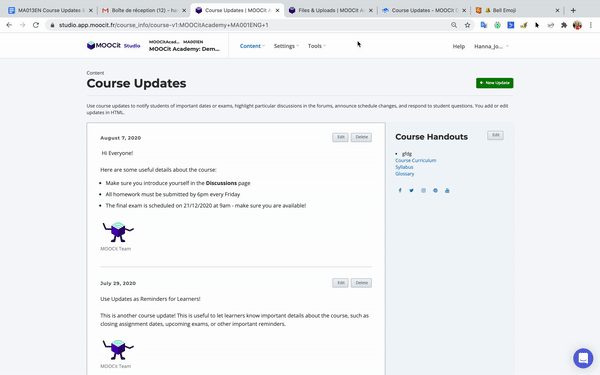

# Course Updates

## Course Updates in Learner View (LMS)&#x20;


Course Updates are available to learners from the Course Update page (accessible via the 🔔 icon in the header menu). When a new update is posted, learners will see a small red notification as follows:&#x20;


## How to add a Course Update

Course updates are accessible from **Studio**  >  **Content** > **Updates**


Select **+ New Update** and an html editor will appear. In the editor, type your update using HTML formatting. If you aren't familiar with HTML, you can copy & paste one of the following templates:&#x20;

### Course Update HTML Templates

#### Welcome Message with Signature + Image


```
<p>Welcome to this online course!!</p>

<p>This course is designed as a demonstration of the functionality of our MOOCit platforms. You are currently reading an <em>Update</em>. The course team can post new "updates" at any time to announce the availability of a new module, a change in the organization of the course, etc. You can close this ad by clicking on the cross at the top right. All course announcements are available in the Announcements menu.</p> 
<p>
  Enjoy.
</p>
<br>
<p>
  <b>Hanna Johnson</b><br>
<em style="color:#888; font-size:14px;">Customer Success, MOOCit</em>
</p>

```

#### Standard Update with bulleted list + signature image


```
<p>&nbsp;Hi Everyone!&nbsp;</p>
<p>Here are some useful details about the course:&nbsp;</p>
<ul>
<li>Make sure you introduce yourself in the <strong>Discussions</strong> page</li>
<li>All homework must be submitted by 6pm every Friday</li>
  <li><em>The final exam is scheduled on 21/12/2020 at 9am - make sure you are available!</em></li> <br>
</ul>
<p><b></b><br>
<em style="color:#888; font-size:14px;">MOOCit Team</em>
</p>
```

### Modify HTML Image&#x20;

1. Open **Content** > **Files & Uploads** in a new Window&#x20;
2. Select to copy the **Studio** URL for the image you want to add
3. Return to **Content** > **Updates** page&#x20;
4. Locate the code `<img src=`&#x20;
5. Replace the code following `<img src=` with the URL you just copied in **Files & Uploads**. &#x20;
6. Select to **Post**&#x20;



